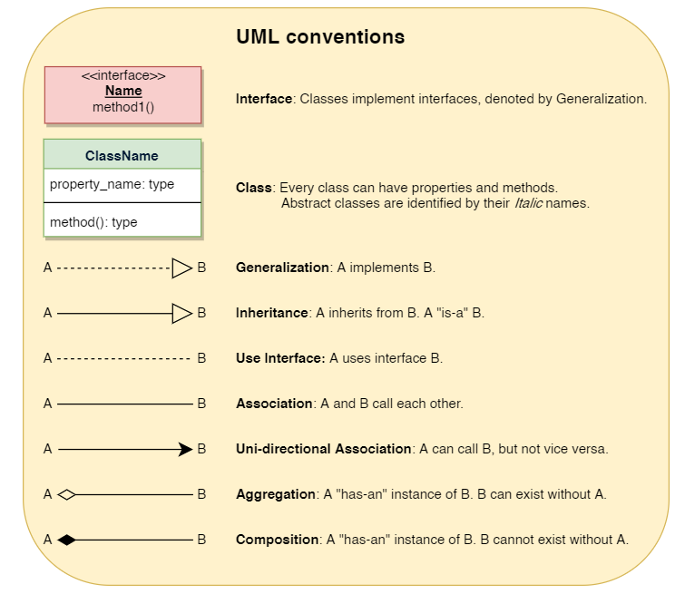
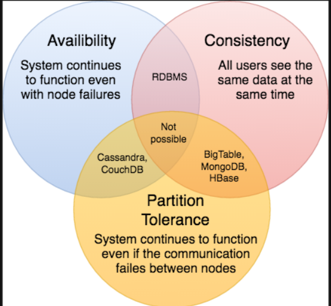

----------------------------------------------------
Notes
----------------------------------------------------
Class Diagrams
----------------------------------------------------
- `Association is when class A holds reference of class B and is only interested in class 
  reference and not internal workings of the class. So modification in class B should not result 
  in breaking the functionality of A.`
- `Aggregation`: In a basic aggregation relationship, the lifecycle of a PART class is 
  independent of the WHOLE class’s lifecycle. In other words, aggregation implies a relationship 
  where the `child can exist independently of the parent`. 
  ```
    class Asset { ... }
    class Player {
        List assets;
        public void AddAsset(Asset newlyPurchasedAsset) { assets.Add(newlyPurchasedAssest); ... }
        ...
    }
  ```
- `Composition`: The composition aggregation relationship is just another form of the 
  aggregation relationship, but the `child class’s instance lifecycle is dependent on the parent 
  class’s instance` lifecycle.` instance creational responsibility` In other words, Composition implies a relationship where the 
  child cannot exist independent of the parent. `class A owns the responsibility for lifecycle 
  of class B. Hence when A gets deleted B does too`.
   ```
    class Asset { ... }
    class Player {
        Asset asset = new Asset(); /*Player owns the responsibilty of creating Asset*/
        ...
    }
  ```
- `Dependency`: Dependency indicates that you may invoke one of the APIs of the received class 
  reference and any modification to that class may break your class as well.
  ```
    class Asset { ... }
    class Player {
        
        public void AddAsset(Asset asset) {  
            asset.printAssetDetails(); /* dependent on the Asset and its method 
                                          printAssetDetails to do work */
        }
        ...
    }
  ```  
- `Generalization`: Generalization is the mechanism for combining similar classes of objects into 
   a single, more general class. `Extends` kind of thing.
  


----------------------------------------------------
CAP Theorem
----------------------------------------------------



